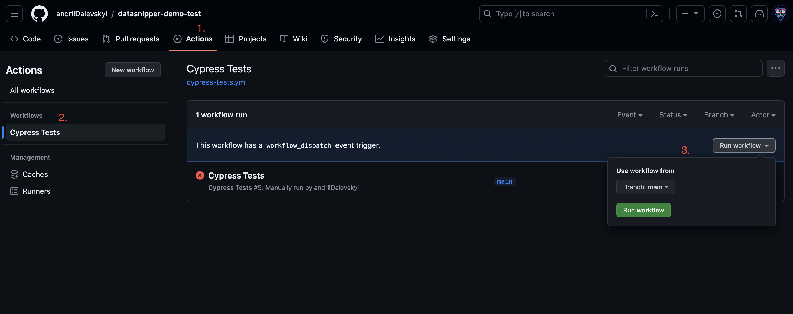
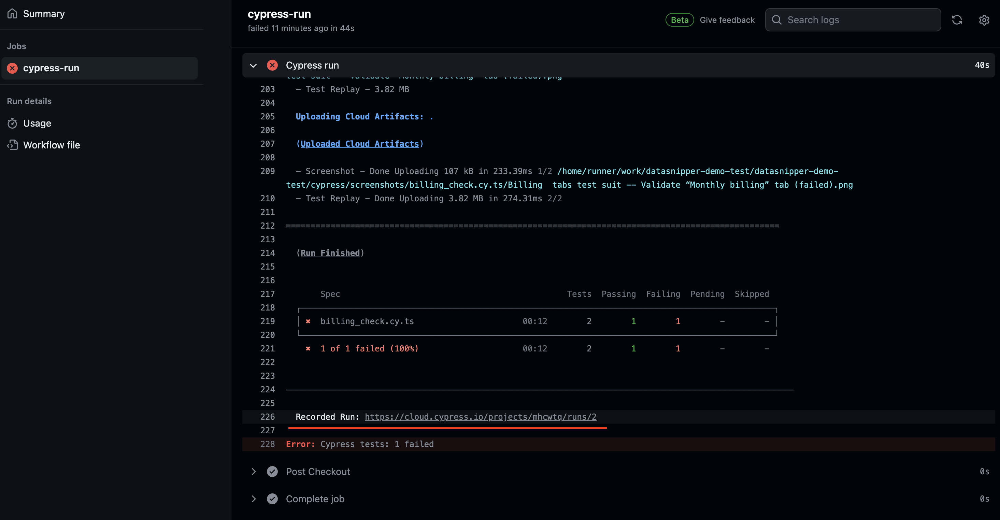
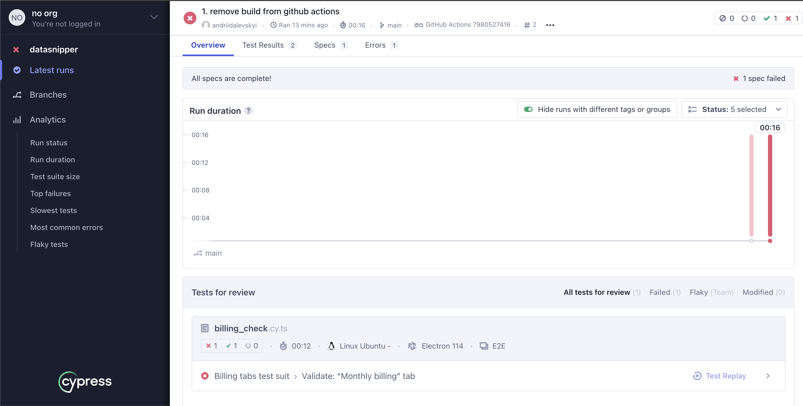

# datasnipper-demo-test

This is a demo framework for testing 'datasnipper.com' service

## How to run tests

- Use for it GitHub Actions -> Cypress Tests -> Run Workflow
  
- After the test run is finished you can see the report on Cypress Cloud's side. For this, go to the job log and use the `Recorded Run` link to redirect the test report
